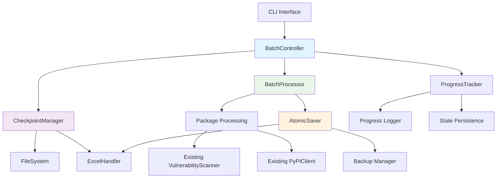

# Design Document - Batch Saving Feature

## Overview

The batch-saving feature enhances the IHACPA Python Package Review Automation system by implementing efficient batch processing for Excel file operations. This system currently processes 486 packages individually and saves changes to the Excel file after each package update. The new feature introduces intelligent batching, intermediate checkpointing, and optimized I/O operations to improve reliability, performance, and user experience while maintaining full compatibility with existing workflows.

## Steering Document Alignment

Since no steering documents were found in the project, this design follows the existing architectural patterns discovered in the codebase analysis.

### Technical Standards 

The design follows the existing technical patterns:
- **Configuration Management**: Uses existing `ConfigManager` and dataclass-based configuration system
- **Logging System**: Extends the existing `ProgressLogger` and error handling patterns
- **Excel Operations**: Builds upon the current `ExcelHandler` class with openpyxl
- **Async Processing**: Maintains the existing asyncio-based batch processing architecture
- **Error Handling**: Follows the established error handling patterns with proper logging

### Project Structure 

The implementation follows the project's modular structure:
- Core functionality in `src/` directory
- Configuration management through existing YAML-based system
- Logging and monitoring through established patterns
- Integration with existing CLI interface in `main.py`

## Code Reuse Analysis

The batch-saving feature leverages extensive existing code to minimize development effort and maintain consistency.

### Existing Components to Leverage

- **ConfigManager**: Extend with new batch processing configuration options
- **ExcelHandler**: Enhance with atomic save operations and backup management
- **ProgressLogger**: Extend with batch-level progress tracking and checkpoint state logging
- **Main IHACPAAutomation class**: Integrate batch processing logic into existing `_process_batch` method
- **CLI Interface**: Add new command-line options for batch control and resume functionality

### Integration Points

- **Configuration System**: Add new `BatchConfig` dataclass to existing configuration hierarchy
- **Excel I/O**: Integrate with existing `save_workbook` method to support atomic operations
- **Progress Tracking**: Extend existing progress logging to include batch and checkpoint information
- **Error Handling**: Use existing `ErrorHandler` class for batch operation error management
- **File System**: Integrate with existing backup directory structure in `data/backups/`

## Architecture

The batch-saving system introduces a layered architecture that wraps existing processing logic with enhanced batch management, checkpointing, and recovery capabilities.



## Components and Interfaces

### BatchController
- **Purpose:** Orchestrates batch processing with checkpoint management and recovery
- **Interfaces:** 
  - `start_processing(packages, start_mode)` - Main entry point for batch processing
  - `resume_from_checkpoint(checkpoint_path)` - Resume processing from existing checkpoint
  - `validate_resume_state(excel_file, checkpoint)` - Validate Excel state against checkpoint
- **Dependencies:** CheckpointManager, BatchProcessor, ProgressTracker, existing Config
- **Reuses:** Integrates with existing `IHACPAAutomation.process_packages()` method

### CheckpointManager
- **Purpose:** Manages checkpoint creation, validation, and recovery operations
- **Interfaces:**
  - `create_checkpoint(batch_number, progress_state, excel_backup)` - Create checkpoint file
  - `load_checkpoint(checkpoint_path)` - Load and validate checkpoint data
  - `cleanup_checkpoints(scan_id)` - Clean up checkpoint files after successful completion
  - `list_available_checkpoints()` - List available checkpoint files for recovery
- **Dependencies:** FileSystem operations, existing backup directory structure
- **Reuses:** Extends existing backup patterns from `ExcelHandler`

### BatchProcessor  
- **Purpose:** Enhanced batch processing with configurable strategies and memory management
- **Interfaces:**
  - `process_batch(packages, batch_config)` - Process a batch with specified strategy
  - `adjust_batch_size(memory_usage, performance_metrics)` - Dynamic batch size adjustment
  - `coalesce_operations(pending_batches)` - Optimize multiple batch operations
- **Dependencies:** AtomicSaver, existing package processing logic, memory monitoring
- **Reuses:** Builds upon existing `_process_batch` method in main.py

### AtomicSaver
- **Purpose:** Ensures atomic Excel save operations with backup and rollback capabilities
- **Interfaces:**
  - `atomic_save(excel_handler, batch_updates)` - Save batch updates atomically
  - `create_backup(excel_file)` - Create backup before atomic operation
  - `rollback_on_failure(backup_path)` - Restore from backup on save failure
- **Dependencies:** ExcelHandler, file locking mechanisms, existing backup patterns
- **Reuses:** Enhances existing `ExcelHandler.save_workbook()` method

### ProgressTracker
- **Purpose:** Tracks batch-level progress with checkpoint integration and recovery state
- **Interfaces:**
  - `track_batch_progress(batch_number, completed_packages, batch_metrics)`
  - `persist_progress_state(checkpoint_data)` - Save progress state to checkpoint
  - `generate_recovery_summary(checkpoint)` - Generate detailed recovery information
- **Dependencies:** CheckpointManager, existing ProgressLogger
- **Reuses:** Extends existing `ProgressLogger` class with batch-aware functionality

### BatchConfigurationManager
- **Purpose:** Manages batch processing configuration and strategy selection
- **Interfaces:**
  - `load_batch_config(config_file)` - Load batch-specific configuration
  - `select_strategy(environment, resource_constraints)` - Choose optimal batch strategy
  - `validate_batch_settings(config)` - Validate batch configuration parameters
- **Dependencies:** Existing ConfigManager, YAML configuration system
- **Reuses:** Extends existing configuration management patterns

## Data Models

### BatchState
```python
@dataclass
class BatchState:
    scan_id: str                    # Unique identifier for this processing session
    current_batch: int             # Current batch number being processed
    total_batches: int             # Total number of batches to process
    completed_packages: int        # Total packages completed so far
    total_packages: int            # Total packages to process
    batch_strategy: str            # Current batching strategy (fixed-size, memory-adaptive, time-based)
    batch_size: int               # Current batch size
    last_checkpoint_batch: int     # Last batch where checkpoint was created
    processing_statistics: Dict    # Performance metrics and timing data
    created_at: datetime           # When this batch state was created
    updated_at: datetime           # Last update timestamp
```

### CheckpointData
```python
@dataclass 
class CheckpointData:
    checkpoint_id: str             # Unique checkpoint identifier
    scan_id: str                  # Associated scan session ID
    batch_number: int             # Batch number when checkpoint was created
    batch_state: BatchState       # Complete batch processing state
    excel_backup_path: str        # Path to Excel backup file
    excel_file_hash: str          # Hash of Excel file for integrity validation
    package_progress: List[str]   # List of completed package names
    processing_metadata: Dict     # Additional processing context
    created_at: datetime          # Checkpoint creation timestamp
    expires_at: datetime          # Checkpoint expiration timestamp
```

### BatchConfiguration
```python
@dataclass
class BatchConfiguration:
    strategy: str = "fixed-size"           # Batch processing strategy
    default_batch_size: int = 10           # Default packages per batch  
    min_batch_size: int = 1               # Minimum allowed batch size
    max_batch_size: int = 100             # Maximum allowed batch size
    checkpoint_frequency: int = 5          # Create checkpoint every N batches
    memory_threshold: float = 0.8         # Memory usage threshold for adaptive sizing
    time_based_interval: int = 300        # Time-based save interval (seconds)
    max_concurrent_batches: int = 1       # Maximum concurrent batch operations
    atomic_operations: bool = True        # Enable atomic save operations
    backup_on_checkpoint: bool = True     # Create Excel backup on checkpoint
    cleanup_on_success: bool = True       # Clean up checkpoints on completion
    retry_failed_batches: bool = True     # Retry failed batch operations
    max_retry_attempts: int = 3           # Maximum retry attempts per batch
```

### RecoveryOptions
```python
@dataclass
class RecoveryOptions:
    resume_mode: str              # "auto", "custom", "fresh"
    start_from_package: int = 0   # Package number to start from (0-based)
    start_from_batch: int = 0     # Batch number to start from (0-based)
    force_continue: bool = False  # Force continue despite validation warnings
    validate_excel_state: bool = True  # Validate Excel file state before resume
    merge_strategy: str = "use_checkpoint"  # How to handle Excel file conflicts
```

## Error Handling

### Error Scenarios

1. **Batch Processing Failure**
   - **Handling:** Save completed packages from current batch, log failure details, continue with next batch
   - **User Impact:** Processing continues with minimal data loss, failed batch logged for manual review

2. **Checkpoint Creation Failure**
   - **Handling:** Log error, continue processing without checkpoint, warn user about reduced recovery capability
   - **User Impact:** Processing continues but recovery options are limited if interrupted

3. **Excel File Corruption During Save**
   - **Handling:** Restore from most recent backup, retry save operation with reduced batch size
   - **User Impact:** Temporary pause in processing while file is restored, then continues normally

4. **Memory Threshold Exceeded**
   - **Handling:** Automatically reduce batch size, save current progress, continue with smaller batches
   - **User Impact:** Processing slows slightly but continues without interruption

5. **Checkpoint File Corruption**
   - **Handling:** Attempt to load previous checkpoint, offer manual recovery options if no valid checkpoints found
   - **User Impact:** User prompted to choose recovery strategy or start fresh

6. **Excel State Validation Failure on Resume**
   - **Handling:** Show diff between expected and actual state, offer merge options or fresh start
   - **User Impact:** User presented with clear options and detailed information to make informed decision

7. **Concurrent Access Detection**
   - **Handling:** Use file locking to prevent conflicts, queue operations if necessary
   - **User Impact:** Brief delay while waiting for file access, then processing continues normally

8. **Disk Space Exhaustion**
   - **Handling:** Clean up old backups and checkpoints, reduce checkpoint frequency, alert user
   - **User Impact:** Warning message displayed, processing continues with reduced backup retention

## Testing Strategy

### Unit Testing

**Key Components to Test:**
- **CheckpointManager**: Checkpoint creation, loading, validation, and cleanup operations
- **AtomicSaver**: Atomic save operations, backup creation, rollback functionality
- **BatchProcessor**: Batch processing strategies, memory adaptation, error handling 
- **ProgressTracker**: Progress calculation, state persistence, recovery summary generation
- **BatchConfigurationManager**: Configuration loading, validation, strategy selection

**Test Scenarios:**
- Checkpoint file format validation and backward compatibility
- Atomic save operations under various failure conditions
- Memory-adaptive batch sizing with different memory pressure scenarios
- Progress state persistence and recovery accuracy
- Configuration validation with invalid and edge-case values

### Integration Testing

**Key Flows to Test:**
- **Complete Batch Processing Flow**: End-to-end processing with checkpoints and atomic saves
- **Recovery Flow**: Interruption and resume scenarios with different checkpoint states
- **Configuration Integration**: Batch settings integration with existing configuration system
- **Excel Integration**: Batch operations integration with existing ExcelHandler functionality
- **CLI Integration**: New command-line options working with existing CLI interface

**Test Scenarios:**
- Processing 486 packages with different batch sizes and strategies
- Recovery from various interruption points (mid-batch, between batches, during saves)
- Memory pressure scenarios causing dynamic batch size adjustments
- Excel file corruption and recovery testing
- Multi-user scenario with file locking

### End-to-End Testing

**User Scenarios to Test:**
- **Complete Fresh Processing**: New user processing full 486-package dataset with batching enabled
- **Interrupted Processing Recovery**: User resuming interrupted scan from various checkpoint states
- **Configuration Customization**: User customizing batch settings for different environments
- **Error Recovery**: User handling various error conditions with guided recovery options
- **Performance Comparison**: Comparing batch processing performance against individual processing

**Performance Validation:**
- Verify 30-50% performance improvement over individual package processing
- Confirm memory usage stays below 1GB regardless of batch size
- Validate checkpoint creation completes within 5 seconds
- Test atomic operations maintain data integrity under stress conditions

The testing strategy ensures reliability across all batch processing scenarios while maintaining compatibility with existing functionality.

---

Does the design look good? If so, we can move on to the implementation planning phase.