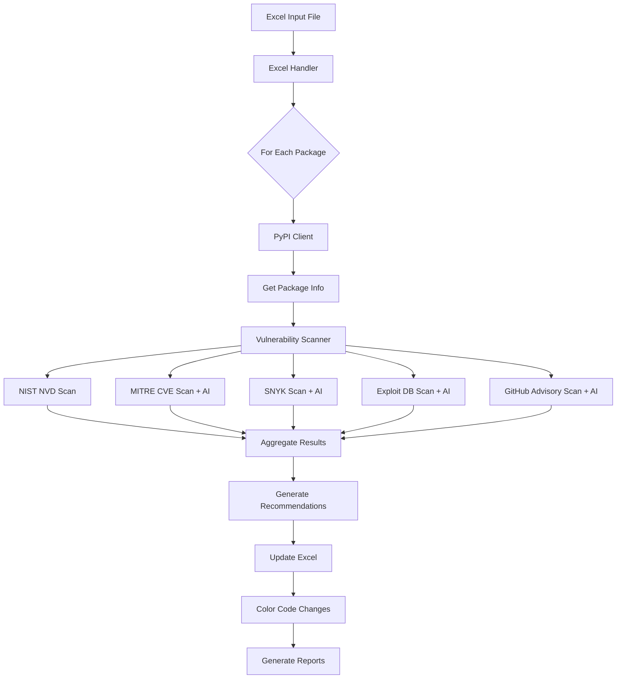

# IHACPA Python Package Review Automation - Detailed Design Document

## Table of Contents
1. [Overview](#overview)
2. [System Architecture](#system-architecture)
3. [Core Components](#core-components)
4. [Data Flow](#data-flow)
5. [Vulnerability Detection Logic](#vulnerability-detection-logic)
6. [AI Integration](#ai-integration)
7. [Recommendation Generation Logic](#recommendation-generation-logic)
8. [Excel Processing](#excel-processing)
9. [Color Coding System](#color-coding-system)
10. [Error Handling](#error-handling)
11. [Configuration Management](#configuration-management)

## Overview

The IHACPA Python Package Review Automation system is designed to automatically analyze Python packages for security vulnerabilities, version updates, and compliance requirements. It integrates with multiple vulnerability databases and uses AI-powered analysis to provide comprehensive security assessments.

### Key Features
- Multi-database vulnerability scanning (NIST NVD, MITRE CVE, SNYK, Exploit DB, GitHub Advisory)
- AI-powered vulnerability analysis using Azure OpenAI GPT-4o-mini
- Automated Excel report generation with color-coded changes
- Standardized result messaging
- Comprehensive recommendation generation

## System Architecture

```
┌─────────────────────────────────────────────────────────────────┐
│                          Main Entry Point                         │
│                            (main.py)                              │
└─────────────────────────┬───────────────────────────────────────┘
                          │
                          ▼
┌─────────────────────────────────────────────────────────────────┐
│                       Excel Handler Layer                         │
│                      (excel_handler.py)                           │
│  • Read Excel input                                               │
│  • Process packages                                               │
│  • Write results with color coding                                │
└─────────────────────────┬───────────────────────────────────────┘
                          │
                          ▼
┌─────────────────────────────────────────────────────────────────┐
│                    Core Processing Layer                          │
├─────────────────────────┴───────────────────────────────────────┤
│  ┌─────────────────┐  ┌─────────────────┐  ┌─────────────────┐ │
│  │  PyPI Client    │  │ Vulnerability   │  │ AI CVE Analyzer │ │
│  │ (pypi_client.py)│  │    Scanner      │  │(ai_cve_analyzer)│ │
│  │                 │  │(vuln_scanner.py)│  │                 │ │
│  └─────────────────┘  └─────────────────┘  └─────────────────┘ │
└─────────────────────────────────────────────────────────────────┘
                          │
                          ▼
┌─────────────────────────────────────────────────────────────────┐
│                    External Services Layer                        │
├─────────────────────────┴───────────────────────────────────────┤
│  • PyPI API                    • Azure OpenAI API                │
│  • NIST NVD API               • MITRE CVE                        │
│  • SNYK                       • Exploit Database                 │
│  • GitHub Security Advisory                                      │
└─────────────────────────────────────────────────────────────────┘
```

## Core Components

### 1. Main Entry Point (main.py)
- Command-line argument parsing
- Orchestrates the entire automation process
- Handles batch processing and progress tracking
- Generates summary reports

### 2. Excel Handler (excel_handler.py)
- **Input Processing:** Reads Excel files with package information
- **Data Mapping:** Maps Excel columns to internal data structures
- **Output Generation:** Writes results with color-coded formatting
- **Change Tracking:** Monitors and reports all modifications

### 3. PyPI Client (pypi_client.py)
- Fetches package metadata from PyPI
- Retrieves version information
- Gets release dates and dependencies
- Handles rate limiting and retries

### 4. Vulnerability Scanner (vulnerability_scanner.py)
- Coordinates scanning across multiple databases
- Implements AI-powered analysis integration
- Standardizes result messages
- Generates comprehensive recommendations

### 5. AI CVE Analyzer (ai_cve_analyzer.py)
- Integrates with Azure OpenAI GPT-4o-mini
- Analyzes vulnerability data with version-specific context
- Provides severity assessments
- Generates actionable recommendations

## Data Flow



## Vulnerability Detection Logic

### Detection Process Flow

1. **Multi-Source Scanning**
   ```python
   for database in ['nist_nvd', 'mitre_cve', 'snyk', 'exploit_db', 'github_advisory']:
       result = await scan_database(package_name, current_version)
   ```

2. **Vulnerability Identification**
   - Check explicit `found_vulnerabilities` flag
   - Check `vulnerability_count > 0`
   - Check AI analysis for `: found` pattern (case-insensitive)
   - Check summary for vulnerability indicators

3. **Severity Assessment**
   ```python
   # Extract severity from AI analysis
   if 'severity: critical' in ai_analysis:
       severity = 'CRITICAL'
   elif 'severity: high' in ai_analysis:
       severity = 'HIGH'
   elif 'severity: medium' in ai_analysis:
       severity = 'MEDIUM'
   elif 'severity: low' in ai_analysis:
       severity = 'LOW'
   ```

### Standardized Result Messages

- **No vulnerabilities found:**
  - GitHub Advisory: "No published security advisories"
  - Other databases: "None found"
  
- **Manual review required:**
  - Format: "Manual review required - check {url}"
  
- **Vulnerabilities found:**
  - AI analysis result with severity and recommendations

## AI Integration

### Azure OpenAI Configuration
```python
{
    'endpoint': AZURE_OPENAI_ENDPOINT,
    'api_key': AZURE_OPENAI_KEY,
    'api_version': AZURE_OPENAI_API_VERSION,
    'model': 'gpt-4o-mini'
}
```

### AI Analysis Prompts

#### MITRE CVE Analysis
```
Analyze CVE results for {package_name} version {current_version}.
Visit {cve_lookup_url} and determine:
1. Are there any CVEs affecting this specific version?
2. What is the severity?
3. What action should be taken?
```

#### SNYK Analysis
```
Analyze SNYK vulnerability database for {package_name} version {current_version}.
Visit {snyk_lookup_url} and check:
1. Known vulnerabilities for this version
2. Severity levels
3. Available patches or workarounds
```

#### GitHub Security Advisory Analysis
```
Analyze GitHub Security Advisories for {package_name} version {current_version}.
Check {github_advisory_url} for:
1. Published security advisories
2. Version-specific impacts
3. Recommended mitigations
```

#### Exploit Database Analysis
```
Check Exploit Database for {package_name} version {current_version}.
Visit {exploit_db_url} to find:
1. Published exploits
2. Proof of concepts
3. Risk assessment
```

### AI Response Format
```
{DATABASE} Analysis: {FOUND/NOT_FOUND} - {description}
Severity: {CRITICAL/HIGH/MEDIUM/LOW/NONE}
Current version {version}: {AFFECTED/NOT_AFFECTED}
Recommendation: {ACTION_NEEDED/NO_ACTION} - {specific_recommendation}
```

## Recommendation Generation Logic

### Core Algorithm

```python
def generate_recommendations(package_name, current_version, latest_version, vulnerability_results):
    # Step 1: Initialize tracking structures
    database_findings = {
        'github_advisory': {'found': False, 'count': 0, 'severity': 'NONE'},
        'nist_nvd': {'found': False, 'count': 0, 'severity': 'NONE'},
        'mitre_cve': {'found': False, 'count': 0, 'severity': 'NONE'},
        'snyk': {'found': False, 'count': 0, 'severity': 'NONE'},
        'exploit_db': {'found': False, 'count': 0, 'severity': 'NONE'}
    }
    
    # Step 2: Parse results from each database
    for db_name, result in scan_results.items():
        vulnerability_found = detect_vulnerability(result)
        
        if vulnerability_found:
            database_findings[db_name]['found'] = True
            # Critical Fix: Ensure count is at least 1 when vulnerabilities are found
            # This prevents the bug where AI-detected vulnerabilities had count=0,
            # causing incorrect "PROCEED" recommendations for vulnerable packages
            vuln_count = result.get('vulnerability_count', 0)
            database_findings[db_name]['count'] = max(vuln_count, 1)
            database_findings[db_name]['severity'] = extract_severity(result)
    
    # Step 3: Calculate totals
    total_vulnerabilities = sum(db['count'] for db in database_findings.values() if db['found'])
    
    # Step 4: Generate recommendation
    if total_vulnerabilities > 0:
        return generate_security_warning(database_findings)
    else:
        return "PROCEED"  # Safe package - no security issues
```

### Recommendation Format

**Security Risk Found:**
```
{version_update} | SECURITY RISK: {total} vulnerabilities found | 
HIGH PRIORITY: {severity} severity vulnerabilities detected | 
Sources: {database}: {count} ({severity}), ... | 
Review security advisories before deployment
```

**No Security Risk:**
```
PROCEED
```

### Key Decision Points

1. **PROCEED Logic:**
   - No vulnerabilities found in any database
   - Ignores version updates when no security issues exist
   - Only returns "PROCEED" for truly safe packages

2. **Security Warning Logic:**
   - At least one vulnerability found
   - Includes version update if available
   - Lists all affected databases with counts and severity
   - Prioritizes HIGH/CRITICAL severity vulnerabilities

## Excel Processing

### Column Mappings

| Column | Field | Description |
|--------|-------|-------------|
| A | Index | Row number |
| B | Package Name | Python package name |
| C | Current Version | Installed version |
| D | PyPI Current Link | PyPI link for current version |
| E | Date Published | Initial publication date |
| F | Latest Version | Latest available version |
| G | PyPI Latest Link | PyPI link for latest version |
| H | Latest Release Date | Most recent release date |
| I | Requires | Package dependencies |
| J | Development Status | Package development status |
| K | GitHub URL | GitHub repository URL |
| L | GitHub Advisory URL | GitHub Security Advisory lookup URL |
| M | GitHub Security Advisory Result | AI-analyzed GitHub advisories |
| N | Notes | Additional notes |
| O | NIST NVD URL | NIST NVD lookup URL |
| P | NIST NVD Result | NIST vulnerability scan results |
| Q | MITRE CVE URL | MITRE CVE lookup URL |
| R | MITRE CVE Result | AI-analyzed CVE results |
| S | SNYK URL | SNYK lookup URL |
| T | SNYK Result | AI-analyzed SNYK results |
| U | Exploit Database URL | Exploit DB lookup URL |
| V | Exploit Database Result | AI-analyzed exploit results |
| W | Recommendation | Generated security recommendation |

### Update Process

1. **Read Phase:**
   - Load Excel file
   - Parse package information
   - Identify packages to process

2. **Process Phase:**
   - Fetch latest package data
   - Run vulnerability scans
   - Generate AI analyses
   - Create recommendations

3. **Write Phase:**
   - Update cell values
   - Apply color coding
   - Track changes
   - Save results

## Color Coding System

### Color Definitions

```python
COLORS = {
    'SECURITY_RISK': {
        'fill': PatternFill(start_color="FFE6E6", end_color="FFE6E6", fill_type="solid"),
        'font': Font(color="CC0000", bold=True)
    },
    'VERSION_UPDATE': {
        'fill': PatternFill(start_color="FFF0E5", end_color="FFF0E5", fill_type="solid"),
        'font': Font(color="FF6600", bold=True)
    },
    'NEW_DATA': {
        'fill': PatternFill(start_color="E6F7E6", end_color="E6F7E6", fill_type="solid"),
        'font': Font(color="008000", bold=True)
    },
    'UPDATED': {
        'fill': PatternFill(start_color="E6F0FF", end_color="E6F0FF", fill_type="solid"),
        'font': Font(color="0066CC", bold=True)
    }
}
```

### Color Application Logic

1. **SECURITY_RISK** (Red):
   - Applied when vulnerabilities are found
   - Used for security-related updates
   - Highest priority visual indicator

2. **VERSION_UPDATE** (Orange):
   - Applied to version-related changes
   - Indicates available updates

3. **NEW_DATA** (Green):
   - Applied when adding new information
   - Used for "None found" or "No published security advisories"

4. **UPDATED** (Blue):
   - Applied for general updates
   - Used for refreshed data

## Error Handling

### Retry Strategy
```python
async def _rate_limited_request(self, database, url, params=None):
    for attempt in range(self.max_retries):
        try:
            async with self.session.get(url, params=params) as response:
                if response.status == 200:
                    return await response.json()
        except asyncio.TimeoutError:
            if attempt < self.max_retries - 1:
                await asyncio.sleep(2 ** attempt)
```

### Error Recovery
- Failed API calls: Log and continue with other databases
- AI analysis failures: Fall back to manual review
- Excel processing errors: Create backup before modifications

### Logging Strategy
- INFO: Normal operations and progress
- WARNING: Non-critical issues (e.g., package not found)
- ERROR: Critical failures requiring attention
- DEBUG: Detailed diagnostic information

## Configuration Management

### Environment Variables
```
AZURE_OPENAI_ENDPOINT=https://your-endpoint.openai.azure.com/
AZURE_OPENAI_KEY=your-api-key
AZURE_OPENAI_API_VERSION=2024-08-01-preview
AZURE_OPENAI_MODEL=gpt-4o-mini
```

### Settings File (azure_settings.yaml)
```yaml
azure_openai:
  endpoint: ${AZURE_OPENAI_ENDPOINT}
  api_key: ${AZURE_OPENAI_KEY}
  api_version: ${AZURE_OPENAI_API_VERSION}
  model: gpt-4o-mini

scanning:
  timeout: 30
  max_retries: 3
  rate_limit: 1.0

processing:
  batch_size: 10
  max_concurrent: 5
```

### Command-Line Options
```
--input: Input Excel file path
--output: Output Excel file path
--packages: Specific packages to process
--dry-run: Preview changes without saving
--config: Custom configuration file
--verbose: Enable detailed logging
```

## Performance Optimizations

1. **Concurrent Processing:**
   - Async/await for all API calls
   - Batch processing for multiple packages
   - Parallel vulnerability scanning

2. **Caching:**
   - 15-minute cache for web fetches
   - Session reuse for HTTP connections

3. **Rate Limiting:**
   - Configurable delays between requests
   - Exponential backoff on failures

## Security Considerations

1. **API Key Management:**
   - Keys stored in environment variables
   - Never logged or exposed in output

2. **Input Validation:**
   - Package names sanitized
   - URL encoding for all queries

3. **Output Sanitization:**
   - Excel formulas escaped
   - Special characters handled properly

## Critical Bug Fixes

### Vulnerability Count Bug (Fixed)

**Problem:** High-severity vulnerabilities (e.g., xlwt with SNYK HIGH severity arbitrary code execution) were incorrectly showing "PROCEED" recommendations.

**Root Cause:** AI-detected vulnerabilities had `vulnerability_count = 0` but were correctly identified as `found = True`. The sum of vulnerability counts was 0, triggering "PROCEED" logic instead of security warnings.

**Solution:** Modified recommendation generation logic to ensure that when vulnerabilities are detected via AI analysis, the count is set to at least 1:

```python
# Before (buggy)
database_findings[db_name]['count'] = result.get('vulnerability_count', 1)  # Could be 0

# After (fixed)
vuln_count = result.get('vulnerability_count', 0)
database_findings[db_name]['count'] = max(vuln_count, 1)  # Always ≥ 1 when found
```

**Impact:** 
- **Before:** xlwt showed "PROCEED" despite HIGH severity vulnerabilities
- **After:** xlwt shows "SECURITY RISK: 2 vulnerabilities found | HIGH PRIORITY: HIGH severity vulnerabilities detected | Sources: GitHub Advisory: 1 (HIGH), SNYK: 1 (HIGH) | Review security advisories before deployment"

**Files Modified:** `src/vulnerability_scanner.py` lines 576-578

**Testing:** Verified with xlwt, requests, urllib3, and safe packages to ensure proper detection and PROCEED logic.

## Future Enhancements

1. **Additional Vulnerability Sources:**
   - OSV (Open Source Vulnerabilities)
   - Safety DB
   - Custom organization databases

2. **Enhanced AI Analysis:**
   - Multi-model consensus
   - Confidence scoring
   - Automated patch suggestions

3. **Reporting Enhancements:**
   - PDF report generation
   - Dashboard integration
   - Trend analysis

4. **Integration Options:**
   - CI/CD pipeline integration
   - Slack/Teams notifications
   - JIRA ticket creation