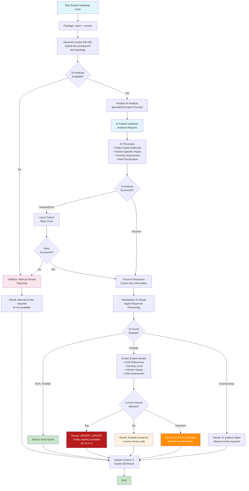
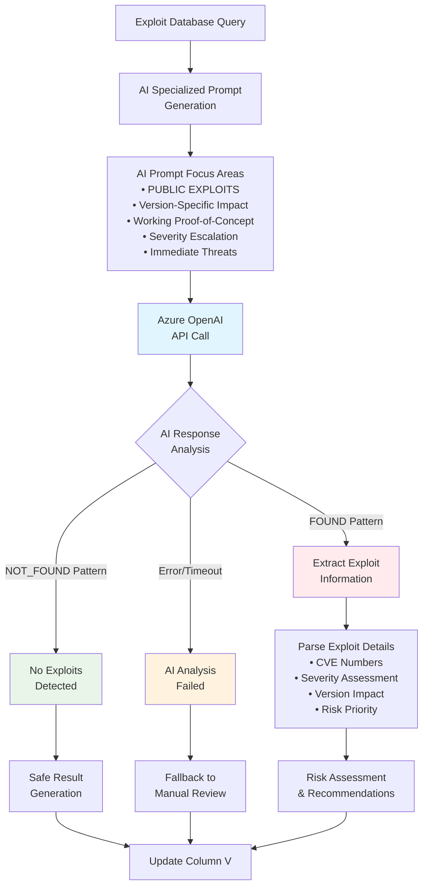
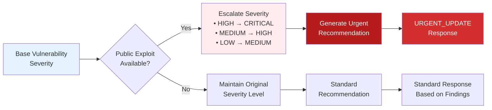
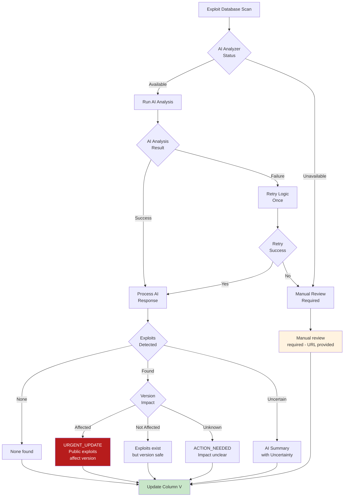
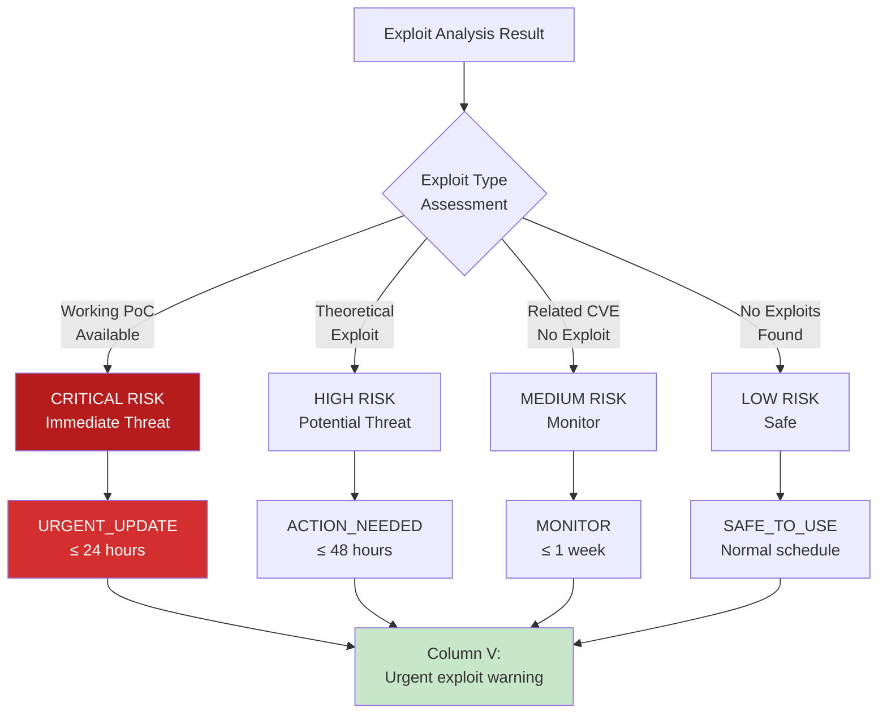
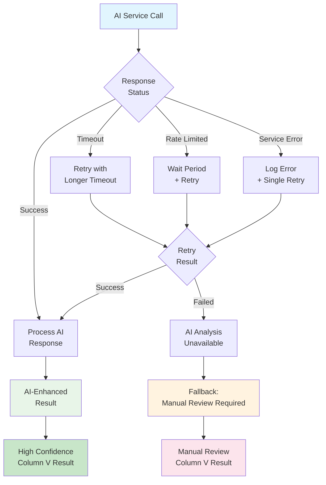
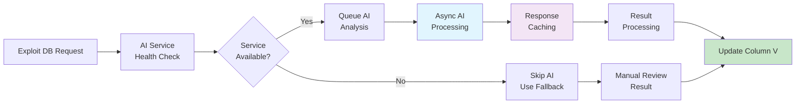
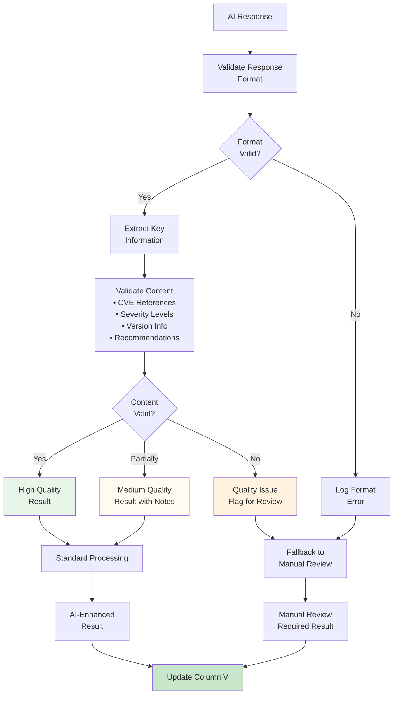
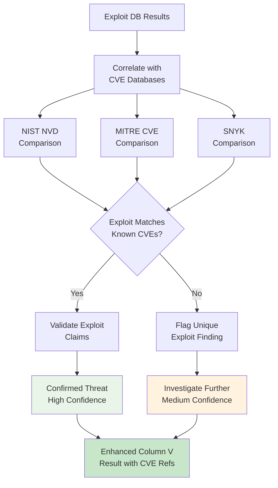
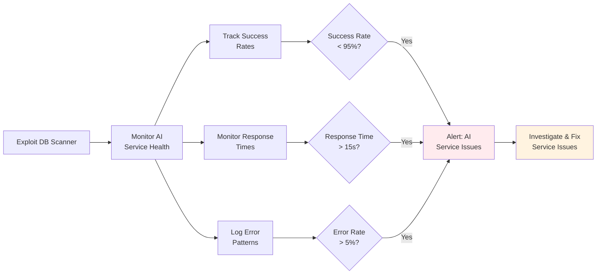

# Exploit Database Vulnerability Scanning Flow Diagram



## AI-Powered Exploit Analysis Pipeline

### Phase 1: AI Analysis Engine



### Phase 2: Severity Escalation Logic



## AI Response Processing Logic

### Response Classification Matrix
```
┌─────────────────────┬─────────────────────┬─────────────────────┐
│ AI Response Pattern │ Interpretation      │ Column V Result     │
├─────────────────────┼─────────────────────┼─────────────────────┤
│ Contains "NOT_FOUND"│ No exploits found   │ None found          │
│ Contains "FOUND"    │ Exploits detected   │ AI-generated summary│
│ Error/Timeout       │ AI analysis failed  │ Manual review       │
│ Empty/Invalid       │ Processing error    │ Manual review       │
│ AI Unavailable      │ Service down        │ Manual review       │
└─────────────────────┴─────────────────────┴─────────────────────┘
```

### AI Prompt Structure for Exploit Database
```
System Role: Cybersecurity expert analyzing Exploit Database
Task Focus:
1. PUBLIC EXPLOITS - immediate actionable threats
2. Version-specific impact assessment
3. Proven working exploits (not theoretical)
4. Severity elevation based on exploit availability
5. Urgent action recommendations for public exploits

Response Format:
"Exploit Database Analysis: [FOUND/NOT_FOUND] - [summary]
Severity: [CRITICAL/HIGH/MEDIUM/LOW/NONE]
Current version X.X.X: [AFFECTED/NOT_AFFECTED]  
Recommendation: [URGENT_UPDATE/ACTION_NEEDED/MONITOR/SAFE_TO_USE]"
```

## Decision Logic Flow

### Primary Decision Tree


## Risk Assessment & Prioritization

### Threat Level Classification


## Error Handling & Resilience Strategy

### AI Service Failure Management


## Performance Optimization Flow

### AI Analysis Optimization


## Quality Assurance Pipeline

### AI Response Validation


## Example Scenarios & Results

### Scenario 1: Critical Public Exploit Found
```
Package: paramiko v2.8.1
AI Analysis: "FOUND - Multiple public exploits available targeting 
             command injection vulnerability CVE-2022-24302"
Version Impact: Current version 2.8.1 directly affected
Severity: CRITICAL (escalated from HIGH due to public exploit)
Result: "URGENT_UPDATE - Public exploits available for paramiko v2.8.1. 
         Immediate update required due to command injection exploit."
```

### Scenario 2: No Exploits Found
```  
Package: text-unidecode v1.3
AI Analysis: "NOT_FOUND - No public exploits found in Exploit Database"
Result: "None found"
```

### Scenario 3: Exploits Exist But Version Safe
```
Package: Pillow v11.3.0  
AI Analysis: "FOUND - Public exploits exist but target versions prior to 10.0.0"
Version Impact: Current version not affected
Result: "Exploits found in database but current version v11.3.0 not affected"
```

### Scenario 4: AI Analysis Unavailable
```
Package: some-package v1.0.0
AI Status: Service timeout/unavailable
Result: "Manual review required - check https://www.exploit-db.com/search?text=some-package"
```

## Integration with Cross-Database Analysis

### Multi-Database Correlation


## Maintenance & Monitoring

### System Health Monitoring


This comprehensive Exploit Database scanning system leverages AI analysis to provide intelligent, contextual assessment of public exploit availability while maintaining robust fallback mechanisms for reliability and comprehensive error handling for production deployment.