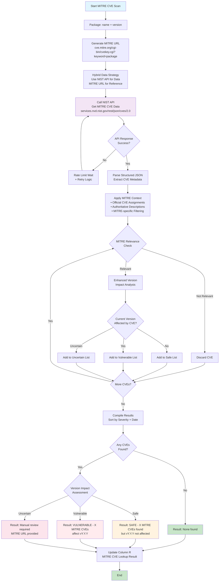
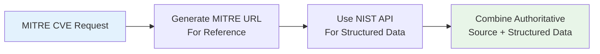
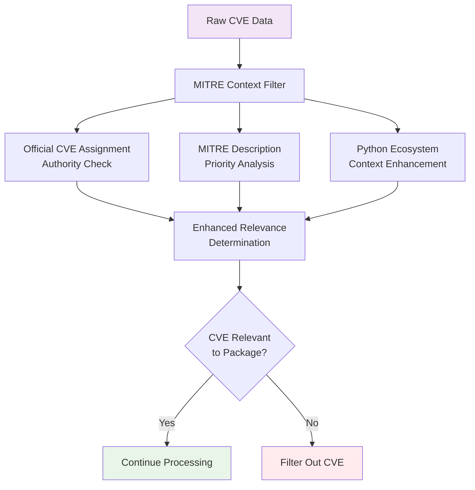
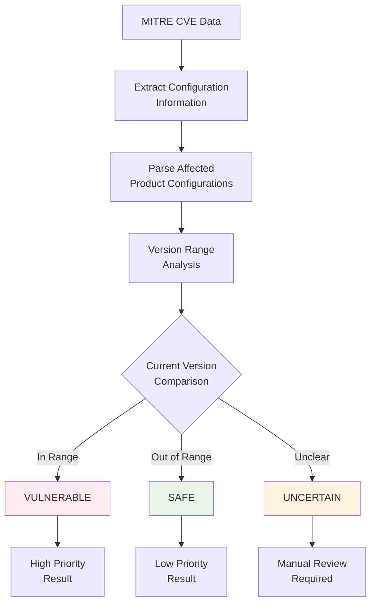
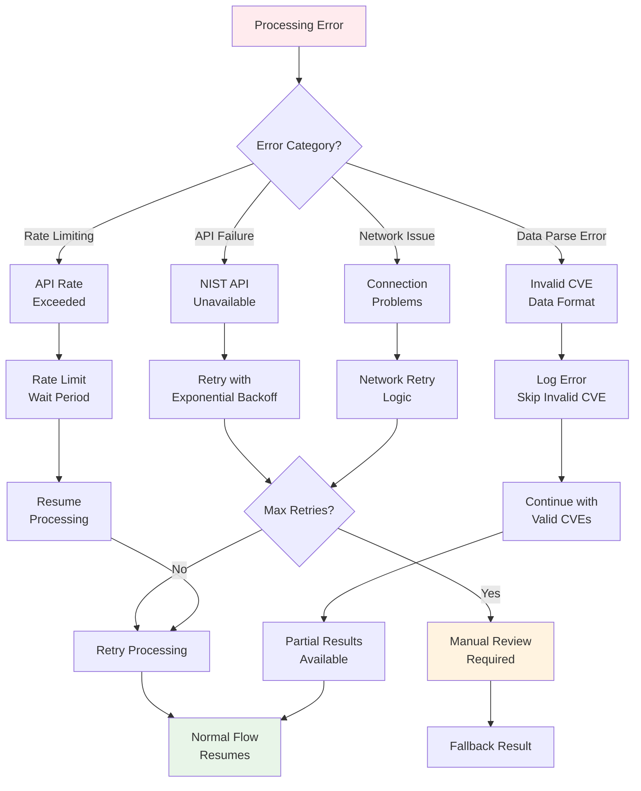
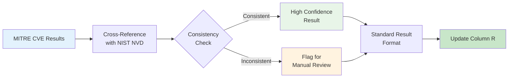
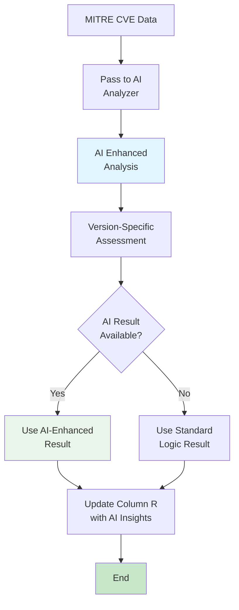

# MITRE CVE Vulnerability Scanning Flow Diagram



## MITRE-Specific Processing Flow

### Phase 1: Hybrid Data Strategy


**Advantages of Hybrid Approach:**
- **Authoritative Source**: MITRE URL provides official reference
- **Structured Data**: NIST API provides machine-readable format
- **Best of Both**: Combines authority with accessibility
- **Performance**: Faster than HTML parsing

### Phase 2: MITRE Context Application



### Phase 3: Version Impact Analysis



## Decision Logic Matrix

### MITRE Relevance Determination
```
CVE Relevance to Python Package:
├── Package name in MITRE description? → RELEVANT
├── Python + package mentioned together? → RELEVANT
├── Pip/PyPI context present? → RELEVANT
├── Generic Python reference only? → NOT_RELEVANT
└── Unrelated vulnerability? → NOT_RELEVANT
```

### Version Impact Classification
```
Version Impact Assessment:
├── Version explicitly listed as vulnerable? → VULNERABLE
├── Version range includes current version? → VULNERABLE
├── Version outside vulnerable range? → SAFE
├── No version information available? → UNCERTAIN
└── Configuration parsing failed? → MANUAL_REVIEW
```

### Result Standardization Logic
```
Final MITRE Result (Column R):
├── No relevant CVEs → "None found"
├── CVEs found, version safe → "SAFE - X MITRE CVEs found but vY.Y.Y not affected"
├── CVEs found, version vulnerable → "VULNERABLE - X MITRE CVEs affect vY.Y.Y"  
└── Impact assessment unclear → "Manual review required"
```

## Error Handling & Resilience Flow



## Performance Optimization Strategy

### 1. Data Source Optimization
- **API over HTML**: Use NIST structured data instead of MITRE HTML parsing
- **Parallel Processing**: Concurrent CVE analysis
- **Smart Caching**: Cache MITRE-contextualized results

### 2. Relevance Filtering Efficiency  
- **Early Filtering**: Eliminate irrelevant CVEs quickly
- **Contextual Matching**: MITRE-specific relevance criteria
- **False Positive Reduction**: Enhanced filtering for Python ecosystem

### 3. Version Analysis Optimization
- **Semantic Versioning**: Efficient version comparison algorithms
- **Range Parsing**: Optimized configuration parsing
- **Early Termination**: Stop on definitive vulnerability detection

## Cross-Database Integration



## Quality Assurance Checkpoints

### 1. Data Validation
- **CVE ID Format**: Validate CVE identifier structure
- **Date Consistency**: Check publication/modification dates
- **Severity Validation**: Verify CVSS score ranges
- **Description Quality**: Ensure meaningful CVE descriptions

### 2. Relevance Validation
- **Package Name Matching**: Verify correct package identification
- **Context Validation**: Confirm Python ecosystem relevance
- **False Positive Detection**: Identify and filter incorrect matches
- **Version Precision**: Validate version impact accuracy

### 3. Result Quality Control
- **Output Consistency**: Ensure standardized result format
- **Severity Accuracy**: Validate severity classifications
- **Actionability**: Confirm recommendations are actionable
- **Traceability**: Maintain links to source CVE data

## Integration with AI Analysis

When AI analysis is available:



**AI Enhancement Benefits:**
- **Contextual Understanding**: Better interpretation of CVE descriptions
- **Version Impact**: More accurate version-specific assessments
- **Risk Prioritization**: Intelligent severity classification
- **Reduced False Positives**: AI-powered relevance filtering