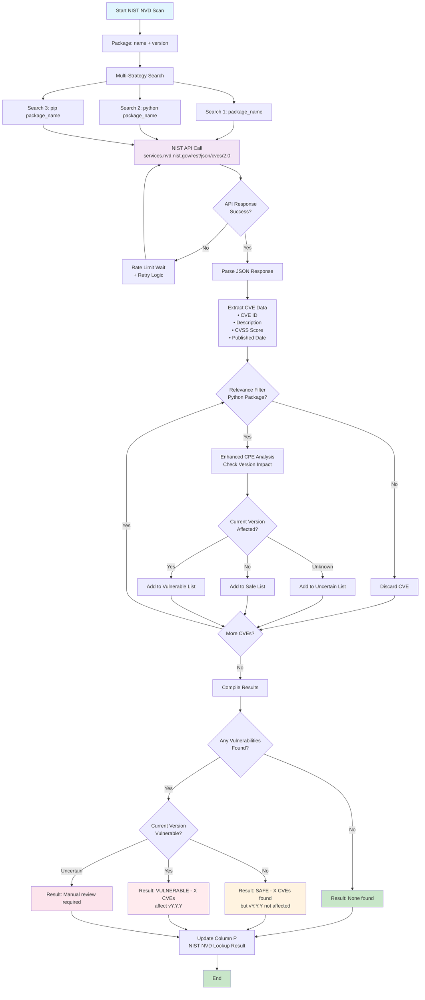
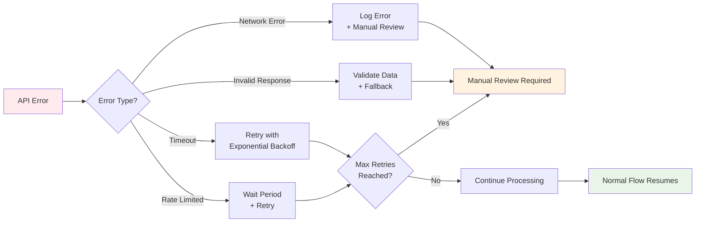

# NIST NVD Vulnerability Scanning Flow Diagram



## Process Flow Description

### Phase 1: Search Strategy (Multi-Vector Approach)
- **Direct Search**: Package name only
- **Python Context**: "python {package_name}"  
- **Ecosystem Search**: "pip {package_name}"
- **Parallel Execution**: All strategies run concurrently

### Phase 2: API Integration & Rate Limiting
- **Endpoint**: NIST NVD REST API v2.0
- **Rate Limiting**: Respects NIST API guidelines
- **Retry Logic**: Exponential backoff on failures
- **Timeout Handling**: 30-second request timeout

### Phase 3: Relevance Filtering
- **Package Name Matching**: Direct string matching in CVE descriptions
- **Python Ecosystem**: Identification of Python-specific vulnerabilities
- **False Positive Reduction**: Multi-layer filtering logic
- **Context Awareness**: Understanding of Python package naming conventions

### Phase 4: Version Impact Analysis  
- **CPE Parsing**: Common Platform Enumeration configuration analysis
- **Version Ranges**: Semantic version range parsing
- **Impact Assessment**: Determine if current version is affected
- **Uncertainty Handling**: Graceful handling of unclear cases

### Phase 5: Result Compilation & Standardization
- **Severity Classification**: CVSS-based severity assignment
- **Result Standardization**: Consistent output format
- **Actionable Recommendations**: Clear guidance for next steps
- **Quality Assurance**: Multi-level validation of results

## Decision Points

### Relevance Determination
```
Is CVE relevant to Python package?
├── Package name in description? → YES
├── "python {package}" mentioned? → YES  
├── "pip {package}" mentioned? → YES
├── "pypi {package}" mentioned? → YES
└── Generic "python" only? → NO (filter out)
```

### Version Impact Assessment
```
Is current version affected?
├── Version in vulnerable range? → VULNERABLE
├── Version outside range? → SAFE
├── No version info available? → UNCERTAIN
└── Parse error? → MANUAL_REVIEW
```

### Result Classification
```
Final Result Determination:
├── No CVEs found → "None found"
├── CVEs found, version safe → "SAFE - X CVEs found but vY.Y.Y not affected"  
├── CVEs found, version vulnerable → "VULNERABLE - X CVEs affect vY.Y.Y"
└── Impact unclear → "Manual review required"
```

## Error Handling Flow



## Performance Optimization Points

### 1. Concurrent Processing
- Multiple search strategies execute in parallel
- CVE processing uses asyncio for concurrency
- Batch processing for multiple packages

### 2. Intelligent Caching
- API response caching within session
- Duplicate CVE detection and elimination  
- Result memoization for identical requests

### 3. Early Termination
- Stop processing when sufficient confidence reached
- Skip detailed analysis for clearly irrelevant CVEs
- Fast-path for packages with no vulnerabilities

### 4. Rate Limit Optimization
- Adaptive rate limiting based on API response headers
- Request queuing to avoid burst limits
- Intelligent retry timing based on service capacity