# Overall Vulnerability Scanning Architecture Diagram

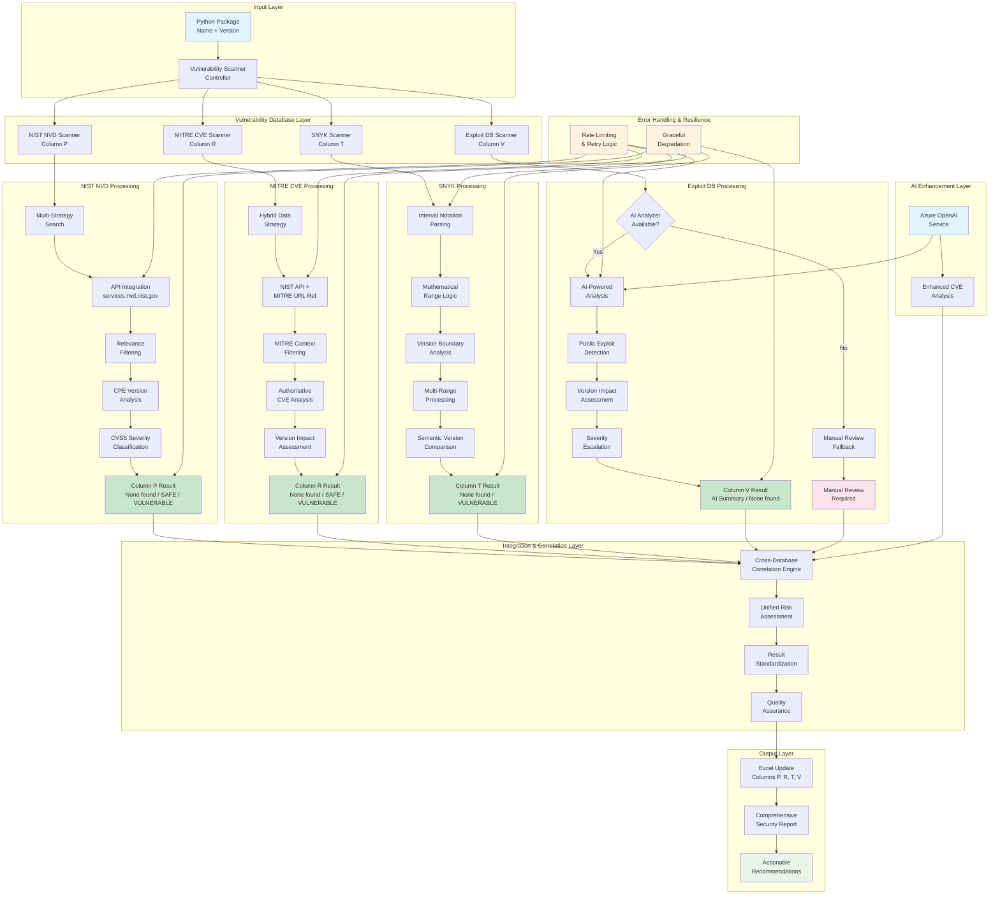

## System Architecture Components

### 1. Input Layer
- **Package Information**: Name and version from Excel file
- **Configuration**: Scanner settings and database preferences
- **Batch Processing**: Handles multiple packages efficiently

### 2. Vulnerability Database Layer
Four independent scanners operating in parallel:

#### NIST NVD Scanner (Column P)
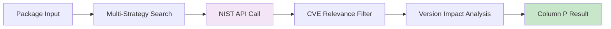

#### MITRE CVE Scanner (Column R)  
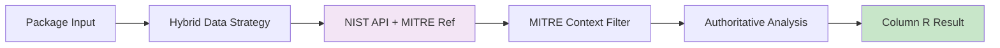

#### SNYK Scanner (Column T)
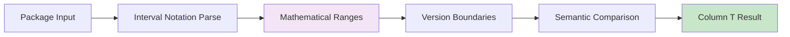

#### Exploit DB Scanner (Column V)
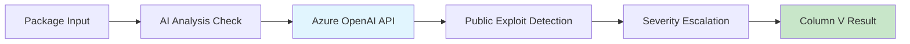

### 3. Cross-Database Integration
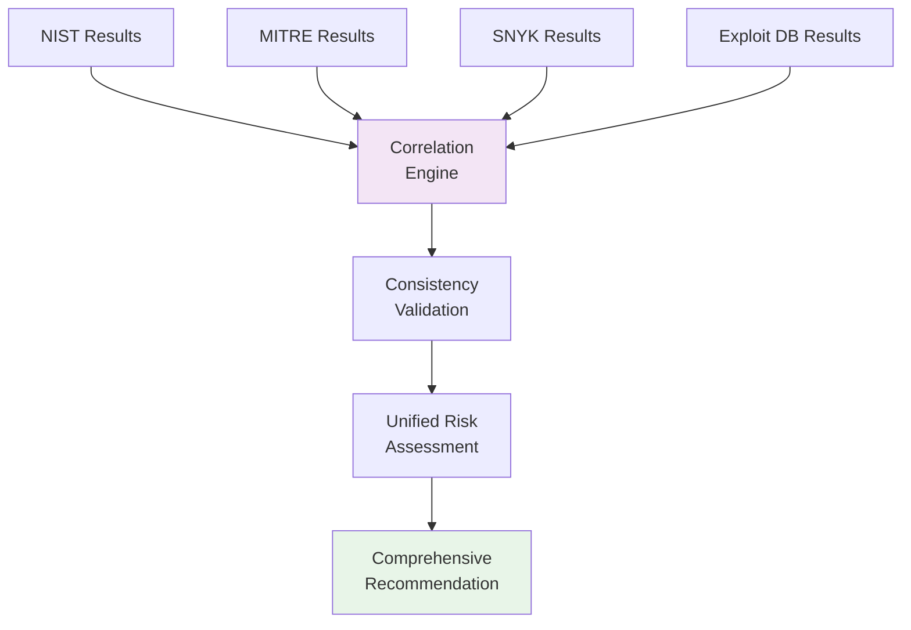

## Data Flow Architecture

### Concurrent Processing Model
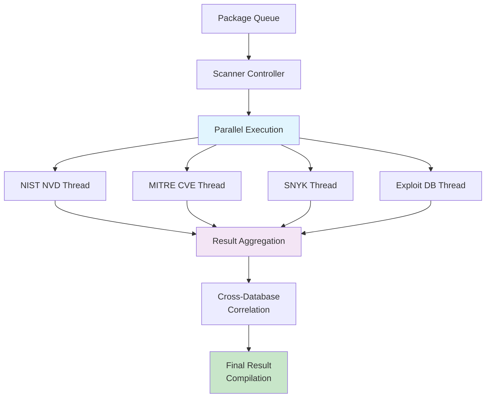

### Error Handling Architecture
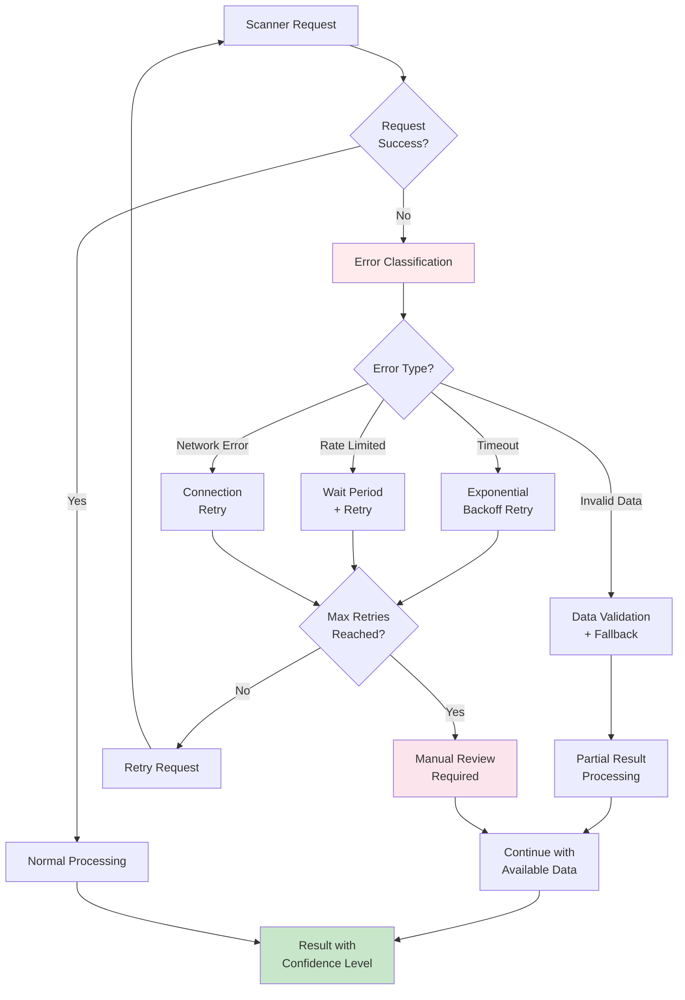

## Performance Optimization Strategy

### 1. Parallel Processing
- **Concurrent Scanning**: All four databases scanned simultaneously
- **Async I/O**: Non-blocking API calls for improved throughput
- **Connection Pooling**: Reuse HTTP connections for efficiency
- **Batch Processing**: Process multiple packages in batches

### 2. Intelligent Caching
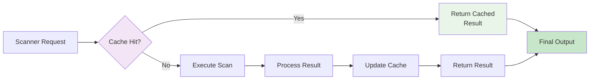

### 3. Rate Limit Management
- **Adaptive Rate Limiting**: Adjust based on API response headers
- **Request Queuing**: Queue requests to avoid burst limits
- **Priority Processing**: Prioritize critical packages
- **Graceful Degradation**: Handle rate limit exceeded scenarios

## Quality Assurance Framework

### Multi-Layer Validation
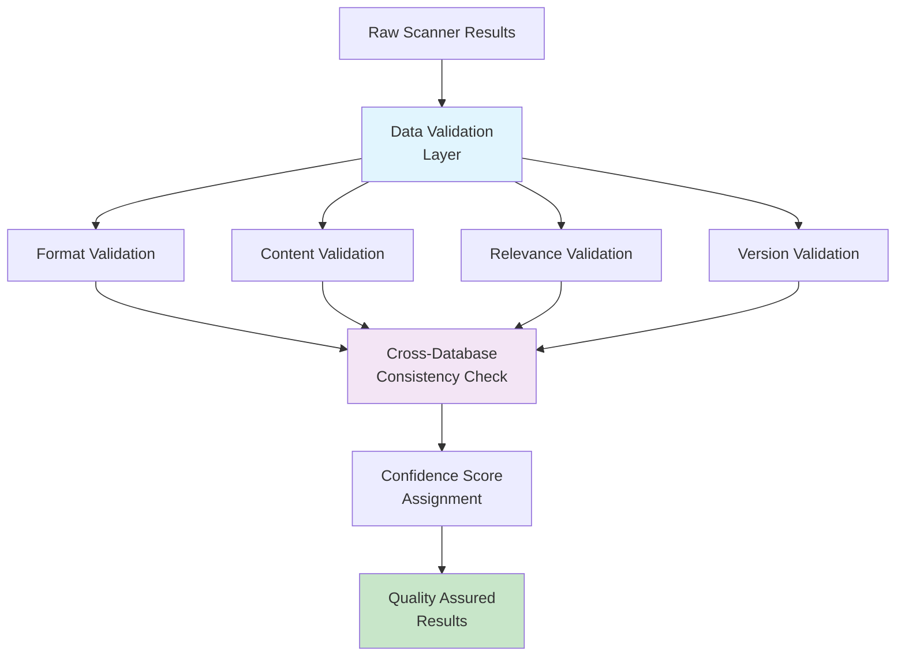

### Result Confidence Levels
- **HIGH**: Multiple database confirmation + version precision
- **MEDIUM**: Single database finding + version match
- **LOW**: Uncertain version impact or single source
- **MANUAL**: Requires human review and validation

## Monitoring & Observability

### System Health Dashboard
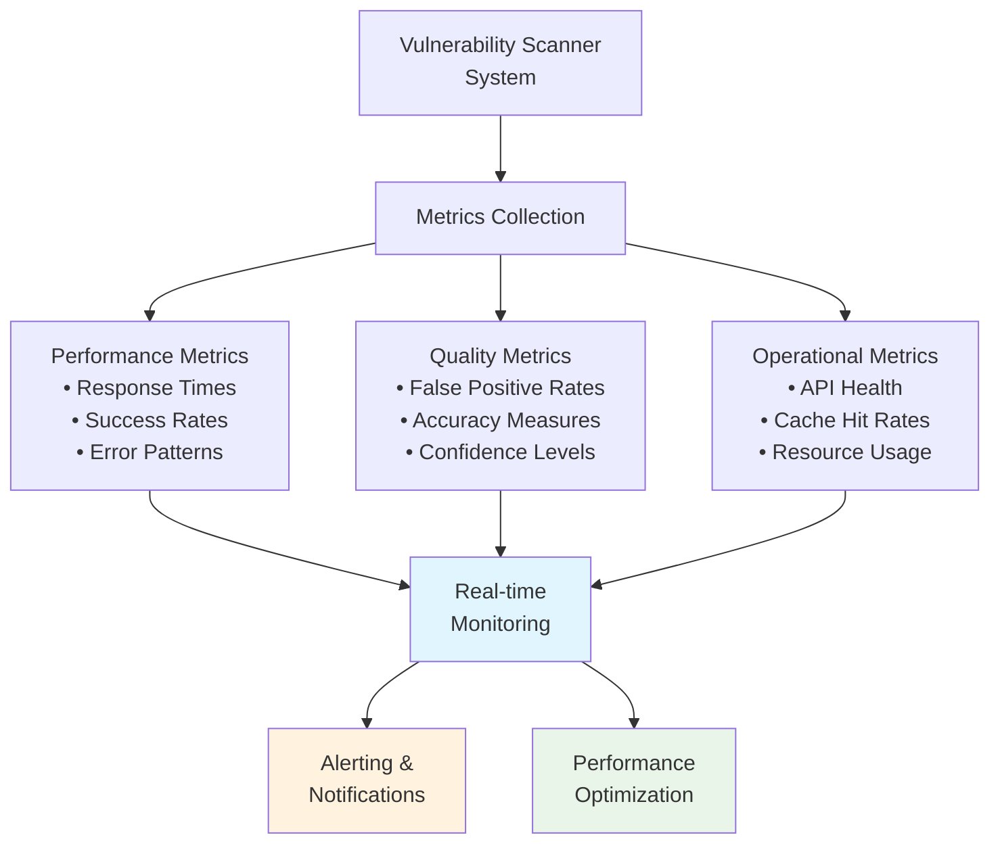

### Operational Alerts
- **API Service Down**: Immediate notification for database unavailability
- **Performance Degradation**: Response time threshold violations  
- **Quality Issues**: False positive rate increases
- **Resource Constraints**: Memory or CPU usage alerts

## Security & Compliance

### Data Security Architecture
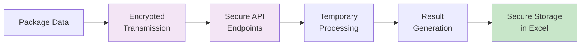

### Privacy Protection
- **No Data Persistence**: Vulnerability data not stored permanently
- **API Key Security**: Encrypted storage of database credentials
- **Audit Logging**: Comprehensive tracking of all scanning activities
- **Access Controls**: Restricted system access and operations

This comprehensive architecture ensures robust, scalable, and reliable vulnerability scanning across multiple authoritative security databases while maintaining high performance and quality standards.