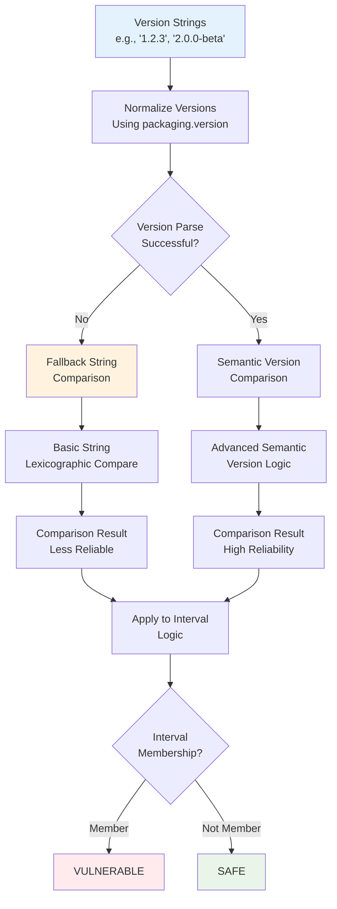
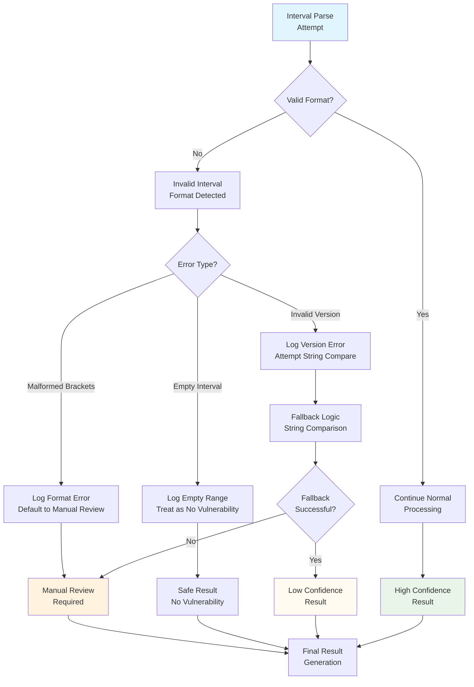
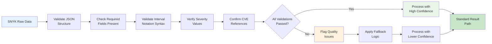
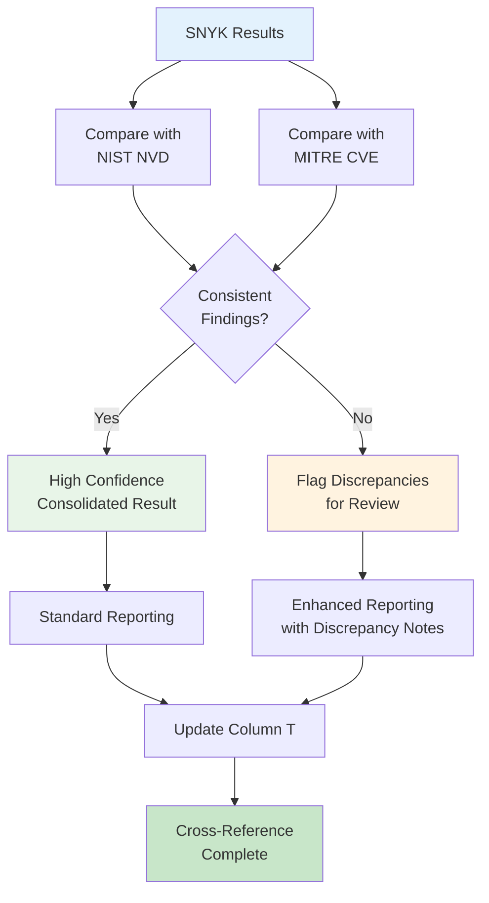

# SNYK Vulnerability Scanning Flow Diagram

```mermaid
graph TD
    A[Start SNYK Scan] --> B[Package: name + version]
    
    B --> C[Generate SNYK URL<br/>security.snyk.io/vuln/pip/{package}]
    
    C --> D[Fetch SNYK Data<br/>Commercial Vulnerability<br/>Intelligence]
    
    D --> E{SNYK API<br/>Response?}
    E -->|Error| F[Rate Limit/Retry<br/>Logic]
    F --> D
    E -->|Success| G[Parse SNYK<br/>Vulnerability Data]
    
    G --> H[Extract Metadata<br/>• Vulnerability ID<br/>• Title & Description<br/>• Severity Level<br/>• Affected Versions<br/>• Related CVEs]
    
    H --> I[Process Interval<br/>Notation Ranges]
    I --> J[Parse Each<br/>Version Range]
    
    J --> K{Interval Format<br/>Valid?}
    K -->|No| L[Log Parse Error<br/>Manual Review]
    K -->|Yes| M[Apply Interval Logic<br/>Mathematical Range Check]
    
    M --> N{Current Version<br/>in Range?}
    N -->|Yes| O[VULNERABLE<br/>Add to Affected List]
    N -->|No| P[SAFE<br/>Version Outside Range]
    
    L --> Q{More<br/>Vulnerabilities?}
    O --> Q
    P --> Q
    Q -->|Yes| J
    Q -->|No| R[Compile Results<br/>Sort by Severity]
    
    R --> S{Any Vulnerabilities<br/>Affect Current Version?}
    S -->|No| T[Result: None found]
    S -->|Yes| U[Result: VULNERABLE<br/>X SNYK vulnerabilities<br/>affect vY.Y.Y]
    S -->|Parse Errors| V[Result: Manual review<br/>required - interval<br/>parsing failed]
    
    T --> W[Update Column T<br/>SNYK Lookup Result]
    U --> W
    V --> W
    
    W --> X[End]

    style A fill:#e1f5fe
    style X fill:#c8e6c9
    style T fill:#c8e6c9
    style U fill:#ffebee
    style V fill:#fce4ec
    style M fill:#f3e5f5
```

## SNYK Interval Notation Processing

### Phase 1: Interval Notation Parser

```mermaid
graph TD
    A[SNYK Affected Versions<br/>e.g. '[1.0.0,2.0.0)', '[,3.7.2)'] --> B[Parse Each Interval]
    
    B --> C{Interval Format<br/>Analysis}
    C --> D[Extract Boundaries<br/>Lower & Upper Bounds]
    C --> E[Determine Inclusion<br/>[ ] = Inclusive<br/>( ) = Exclusive]
    C --> F[Handle Edge Cases<br/>'[,version)' '[version,)']
    
    D --> G[Lower Bound<br/>Processing]
    E --> H[Inclusion Flag<br/>Processing]
    F --> I[Open Range<br/>Processing]
    
    G --> J[Version Comparison<br/>Engine]
    H --> J
    I --> J
    
    J --> K{Current Version<br/>Comparison Result}
    K -->|In Range| L[VULNERABLE]
    K -->|Out of Range| M[SAFE]
    K -->|Parse Error| N[MANUAL_REVIEW]
    
    style A fill:#e3f2fd
    style L fill:#ffebee
    style M fill:#e8f5e8
    style N fill:#fff3e0
```

### Phase 2: Mathematical Interval Logic

```mermaid
graph LR
    A[Interval: '[1.0.0,2.0.0)'] --> B[Parse Components]
    
    B --> C[Lower: 1.0.0<br/>Inclusive: True]
    B --> D[Upper: 2.0.0<br/>Inclusive: False]
    
    C --> E[Version >= 1.0.0?]
    D --> F[Version < 2.0.0?]
    
    E --> G{Both Conditions<br/>True?}
    F --> G
    
    G -->|Yes| H[IN RANGE<br/>VULNERABLE]
    G -->|No| I[OUT OF RANGE<br/>SAFE]
    
    style A fill:#e1f5fe
    style H fill:#ffebee
    style I fill:#e8f5e8
```

## Interval Notation Examples & Logic

### Example 1: Standard Range
```
Interval: [1.0.0,2.0.0)
Current Version: 1.5.0

Logic:
├── Lower Bound: 1.0.0 (inclusive) ✓
├── Upper Bound: 2.0.0 (exclusive) ✓  
├── 1.5.0 >= 1.0.0 ? YES
├── 1.5.0 < 2.0.0 ? YES
└── Result: VULNERABLE
```

### Example 2: Open Lower Bound
```
Interval: [,3.7.2)
Current Version: 2.1.0  

Logic:
├── Lower Bound: None (all versions)
├── Upper Bound: 3.7.2 (exclusive)
├── 2.1.0 < 3.7.2 ? YES
└── Result: VULNERABLE
```

### Example 3: Open Upper Bound
```
Interval: (1.5.0,)
Current Version: 2.0.0

Logic:
├── Lower Bound: 1.5.0 (exclusive)  
├── Upper Bound: None (all versions above)
├── 2.0.0 > 1.5.0 ? YES
└── Result: VULNERABLE
```

### Example 4: Safe Version
```
Interval: [1.0.0,2.0.0]
Current Version: 2.5.0

Logic:
├── Lower Bound: 1.0.0 (inclusive)
├── Upper Bound: 2.0.0 (inclusive)
├── 2.5.0 >= 1.0.0 ? YES
├── 2.5.0 <= 2.0.0 ? NO
└── Result: SAFE
```

## Version Comparison Engine



## Multi-Range Processing Logic

```mermaid
graph TD
    A[Multiple SNYK Ranges<br/>e.g., '[1.0.0,1.8.0)', '[2.0.0,2.5.0]'] --> B[Process Each Range<br/>Independently]
    
    B --> C[Range 1<br/>Analysis]
    B --> D[Range 2<br/>Analysis]
    B --> E[Range N<br/>Analysis]
    
    C --> F[Result 1<br/>IN/OUT]
    D --> G[Result 2<br/>IN/OUT]  
    E --> H[Result N<br/>IN/OUT]
    
    F --> I[Logical OR<br/>Operation]
    G --> I
    H --> I
    
    I --> J{Any Range<br/>Contains Version?}
    J -->|Yes| K[VULNERABLE<br/>At Least One Match]
    J -->|No| L[SAFE<br/>No Range Matches]
    
    K --> M[Generate Final<br/>Result]
    L --> M
    
    style A fill:#e1f5fe
    style K fill:#ffebee
    style L fill:#e8f5e8
    style I fill:#f3e5f5
```

## Error Handling & Edge Cases

### Parsing Error Flow


## SNYK-Specific Quality Assurance

### Data Validation Pipeline


## Performance Optimization Strategy

### 1. Interval Processing Optimization
- **Compiled Regex**: Pre-compiled patterns for interval parsing
- **Version Caching**: Cache parsed version objects within session
- **Early Exit**: Stop processing on first vulnerability match
- **Parallel Range Checking**: Process multiple ranges concurrently

### 2. SNYK API Optimization  
- **Response Caching**: Cache SNYK responses to avoid duplicate calls
- **Batch Requests**: Where possible, batch multiple package requests
- **Connection Pooling**: Reuse HTTP connections for efficiency
- **Rate Limit Intelligence**: Adaptive rate limiting based on API responses

### 3. Memory Management
- **Streaming Processing**: Process large vulnerability lists incrementally
- **Garbage Collection**: Explicit cleanup of large data structures
- **Memory Monitoring**: Track memory usage during processing
- **Resource Limits**: Set bounds on memory consumption per package

## Result Standardization Matrix

```
┌─────────────────────┬─────────────────────┬─────────────────────┐
│ SNYK Data Status    │ Interval Analysis   │ Column T Result     │
├─────────────────────┼─────────────────────┼─────────────────────┤
│ No Vulnerabilities  │ N/A                 │ None found          │
│ Vulnerabilities     │ Version Not in Range│ None found          │  
│ Vulnerabilities     │ Version in Range    │ VULNERABLE - X SNYK │
│                     │                     │ vulnerabilities     │
│ Vulnerabilities     │ Parse Failed        │ Manual review       │
│                     │                     │ required            │
│ API Error           │ N/A                 │ Manual review       │
│                     │                     │ required            │
└─────────────────────┴─────────────────────┴─────────────────────┘
```

## Integration with Cross-Database Analysis

When correlating SNYK results with other databases:



This comprehensive flow ensures that SNYK's specialized Python vulnerability intelligence is properly processed using their unique interval notation system while maintaining high accuracy and reliability standards.